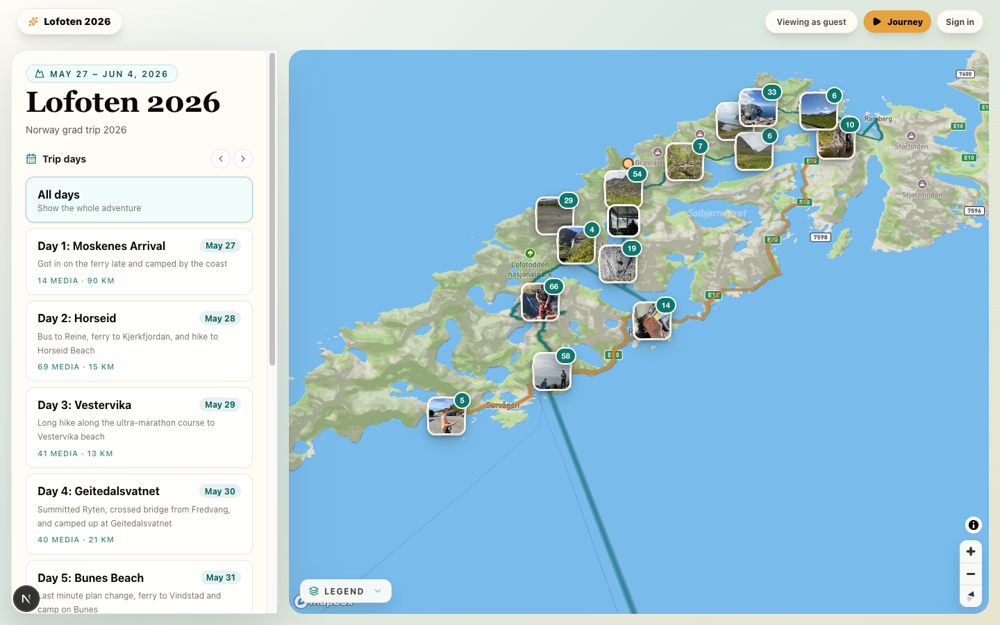
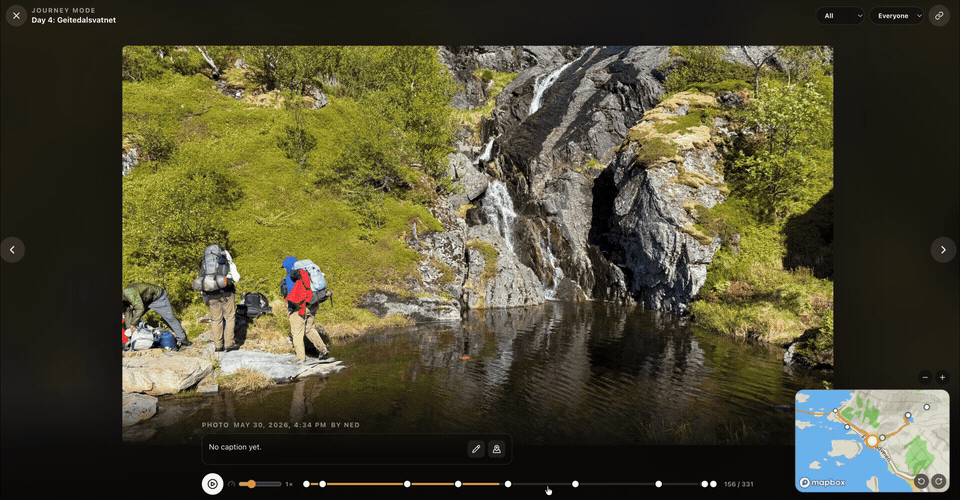
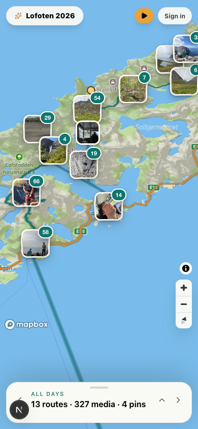

# Lofoten Logbook

A collaborative, real-time trip map and journal. Anyone can explore a trip with
no account — filter days, browse route segments, and open notes and photos
pinned to the map. Signed-in friends auto-join as members to drop their own
notes and geotagged photos, and edits stream to everyone live.

<p>
  <a href="https://lofoten-map-kappa.vercel.app"><strong>▶ Live demo</strong></a>
  &nbsp;·&nbsp; no login required
</p>



<p>
  
  
  
  
  
  
</p>

## Engineering highlights

The interesting problems this project solves:

- **Client-side EXIF geolocation.** Photos are parsed in the browser with
  ExifReader to pull GPS coordinates and capture time, so a dropped photo
  places itself on the map with no server round-trip.
- **Graceful placement fallback.** When a photo has no geotag, the user can
  place it with a map tap, or the app auto-places it along the day's route
  using Turf.js — so ungeotagged photos still land somewhere sensible.
- **Browser-side image pipeline.** Uploads are downscaled and thumbnailed on a
  canvas before they ever hit the network, keeping storage and bandwidth small.
- **Transactional uploads.** If the database insert fails after a file is
  stored, the orphaned object is cleaned up; failures are retryable rather than
  leaving dangling storage.
- **Real authorization, not a toy.** Postgres row-level security enforces
  *public reads, member contributions, and owner-or-admin writes* at the
  database — the client can't bypass it. Members self-serve admin requests that
  existing admins approve in-app.
- **Live collaboration.** Supabase Realtime streams inserts/updates for photos,
  notes, places, and routes, so a second browser sees changes appear instantly.
- **Zero-config demo mode.** With no backend keys set, the app boots from
  bundled sample data — which is exactly how the live demo above runs.

## A closer look

**Journey mode** — step through a day's photos full-screen while a live minimap
tracks where each shot was taken along the route.



The layout is fully responsive: the desktop sidebar collapses into a mobile
bottom sheet, and every map layer, popup, and upload flow works on touch.

<p align="center">
  
</p>

## How it works

The app runs in two modes from the same codebase:

- **Demo mode** — zero config. With no Supabase keys, the app loads bundled
  sample data so the UI is fully explorable immediately. (A Mapbox token is
  still needed for map tiles.) This is what powers the public demo.
- **Supabase mode** — set the Supabase URL + anon key and it becomes a real
  multi-user app backed by Postgres, Storage, Auth, row-level security, and
  Realtime.

## Tech stack

- **Next.js 16** (App Router) + **TypeScript** + **React 19**
- **Tailwind CSS**
- **Mapbox GL JS** — `outdoors-v12` style centered on Reine/Lofoten
- **Supabase** — Postgres, Storage, Auth, membership roles, RLS, Realtime
- **Turf.js** — GeoJSON route/distance utilities
- **ExifReader** — client-side photo metadata parsing
- **Vitest** + **Playwright** + **GitHub Actions** — unit, e2e, and CI

## Quick start

```bash
npm install
cp .env.example .env.local   # add at least NEXT_PUBLIC_MAPBOX_TOKEN
npm run dev                  # http://localhost:3000
```

Leave the Supabase variables blank to stay in demo mode. To force demo mode even
when Supabase keys are present, set `NEXT_PUBLIC_LOCAL_DEMO_MODE=1` — it only
takes effect on `localhost`/`127.0.0.1` and is ignored everywhere else.

### Environment variables

| Variable | Required | Purpose |
| --- | --- | --- |
| `NEXT_PUBLIC_MAPBOX_TOKEN` | Yes | Mapbox access token for map tiles |
| `NEXT_PUBLIC_SUPABASE_URL` | Supabase mode | Supabase project URL |
| `NEXT_PUBLIC_SUPABASE_ANON_KEY` | Supabase mode | Supabase public anon key |
| `NEXT_PUBLIC_TRIP_SLUG` | Yes | Which trip to load (default `lofoten-2026`) |
| `NEXT_PUBLIC_LOCAL_DEMO_MODE` | No | Set to `1` to force demo mode on localhost |

All variables are `NEXT_PUBLIC_*` and shipped to the browser. **Never** put a
Supabase service role key here or in Vercel — the client only needs the public
URL and anon key.

## Architecture

```
app/            Next.js App Router entry (single-page map UI in page.tsx)
components/     Map view, layers, sidebar/mobile sheet, upload/note/route panels,
                admin data panel, legend
lib/            access (role/UI access derivation), exif (EXIF parsing),
                photo-processing (downscale + thumbnails), geo (GeoJSON
                helpers), supabase (browser client), utils
                — with co-located *.test.ts suites
supabase/       schema.sql, seed.sql, grant-member.sql, migrations/
types/          shared trip data types
docs/           work log and todo/roadmap notes
```

The map layer is structured so a future 3D terrain toggle can add a raster DEM
source and call `setTerrain` without reworking the architecture.

## Features

- Full-screen responsive map with a desktop sidebar and a mobile bottom sheet
- Trip-day filtering over a seeded itinerary, with admin-editable day details
- Route segments (ferry / bus / other modes) rendered and styled from GeoJSON
- Photo, note, and place marker layers with popups and a map legend
- Add-note flow that uses a map click/tap for location
- Photo upload pipeline: bulk queue with per-photo review and day assignment,
  client-side EXIF GPS + timestamp extraction, image downscaling and thumbnail
  generation, manual or route-based auto-placement, and retryable failures with
  storage cleanup
- Admin tools: draw route segments, edit trip/day/route/place/photo data,
  manage membership, and review admin-access requests
- Supabase Realtime for photos, notes, places, and route segments
- Row-level security: public reads, member contributions, owner/admin writes

## Development

```bash
npm run dev            # local dev server
npm run lint           # ESLint
npm run typecheck      # next typegen + tsc --noEmit
npm run test           # Vitest unit suite (one-off)
npm run test:watch     # Vitest in watch mode
npm run test:coverage  # unit suite with a coverage report
npm run test:e2e       # Playwright end-to-end suite (demo-mode build)
npm run build          # production build
npm run ci             # lint + typecheck + test (mirrors CI)
```

Unit tests live next to the code they cover (`lib/*.test.ts`) and run under
[Vitest](https://vitest.dev). GitHub Actions runs `lint`, `typecheck`, `test`,
and a demo-mode `build` on every push and pull request to `main`
(see [`.github/workflows/ci.yml`](.github/workflows/ci.yml)).

## Deployment & Supabase setup

The public demo deploys as a standard demo-mode Next.js project. To stand up the
full multi-user backend, expand the sections below.

<details>
<summary><strong>Supabase setup</strong> — schema, auth, and your first admin</summary>

Keep the Supabase variables empty to stay in demo mode. To enable shared mode:

1. Create a Supabase project.
2. In **Authentication**, enable email magic links / OTP.
3. In the **SQL Editor**, run `supabase/schema.sql`, then `supabase/seed.sql`.
4. Put the project URL and anon key in `.env.local`, start the app, and sign in
   once with your email.
5. Edit `supabase/grant-member.sql` with your email and run it to make your
   first account an admin.
6. Reload — you should see the seeded trip and admin controls.
7. Friends can view the trip without signing in. When they sign in, the app
   auto-joins them as members so they can contribute notes/photos and request
   admin access in-app.

### What the schema sets up

`schema.sql` creates the trip data model (`trips`, `days`, `route_segments`,
`photos`, `notes`, `places`, `trip_members`, `admin_requests`), the
`trip-photos` Storage bucket, member/admin RPCs, Realtime publication for the
collaborative tables, and RLS policies:

- **Reads are public** — `select` is granted to `anon` with `using (true)`, so
  anyone can view the trip without an account.
- **Notes and photos** can be created by any signed-in member; each row is
  updatable and deletable by its owner or a trip admin.
- **Trips, days, routes, places, and membership** are admin-scoped.
- **Admin requests** are visible to the requester and existing admins; admins
  can approve or deny them from the Members panel.

### Photo storage

`trip-photos` is a **public** bucket. The `photos` table stores storage *paths*
(`image_path` / `thumbnail_path`), and the app resolves them to plain public URLs
with `getPublicUrl` (`resolvePhotoUrls` in [`lib/supabase.ts`](lib/supabase.ts)) —
a synchronous string build, no signing or expiry, so images load for everyone.

If you are upgrading an existing project, re-run `supabase/schema.sql`: it flips
the bucket to public and (for older databases) migrates the old `image_url` /
`thumbnail_url` columns to `image_path` / `thumbnail_path`.

If the deployed app says Supabase could not find `public.admin_requests` in the
schema cache, your database is behind the app code. Re-run `supabase/schema.sql`
in the Supabase SQL Editor, then refresh the app after Supabase has reloaded its
API schema cache. The trip can still load while that feature is unavailable.

</details>

<details>
<summary><strong>Supabase CLI workflow</strong> — migrations against a linked project</summary>

This repo is initialized for the Supabase CLI. The current schema is captured as
an initial idempotent migration in `supabase/migrations/`, while
`supabase/schema.sql` remains a convenient SQL Editor recovery file.

Install/authenticate/link once:

```bash
brew install supabase/tap/supabase
supabase login
supabase link --project-ref YOUR_PROJECT_REF
```

Then use:

```bash
npm run supabase:migrations  # compare local/remote migration history
npm run supabase:db:dry-run  # preview what would be pushed
npm run supabase:db:push     # apply pending migrations to the linked project
```

For an existing remote database, run the dry-run first. If Supabase reports that
the baseline migration history is out of sync, repair the migration history or
run the idempotent schema once from the SQL Editor before relying on `db push`
for future changes.

</details>

<details>
<summary><strong>Deploying to Vercel</strong> — env vars, auth URLs, and smoke test</summary>

The app deploys as a standard Next.js project — Vercel runs `next build`
automatically, and CI validates a production build on every PR.

1. **Import the repo in Vercel** (New Project → import).
2. **Add environment variables** in Project Settings → Environment Variables:

   ```bash
   NEXT_PUBLIC_MAPBOX_TOKEN=
   NEXT_PUBLIC_SUPABASE_URL=
   NEXT_PUBLIC_SUPABASE_ANON_KEY=
   NEXT_PUBLIC_TRIP_SLUG=lofoten-2026
   ```

   (Omit the Supabase pair to deploy a public demo-mode build.)
3. **Point Supabase Auth at the deployment** under Authentication → URL
   Configuration:
   - Site URL: `https://your-app.vercel.app`
   - Redirect URLs: `https://your-app.vercel.app/**` (keep
     `http://localhost:3000/**` while developing locally)
4. **Run the SQL** if you haven't: `supabase/schema.sql`, then
   `supabase/seed.sql`.
5. **Sign in once** from the deployed app, then run `supabase/grant-member.sql`
   for your email to make that first account an admin. Reload.
6. **Smoke test:**
   - Signed-out visitors see the seeded trip (reads are public); the "Sign in"
     button opens the optional sign-in panel.
   - Your admin account shows contribute/admin controls; a guest does not.
   - A newly signed-in friend can contribute notes/photos and request admin.
   - A note saves and survives reload.
   - A small photo uploads, renders on the map, and survives reload.
   - An admin can approve/deny admin requests and adjust member roles.
   - Realtime updates appear in a second browser session.

</details>

## Roadmap

See [`docs/TODO.md`](docs/TODO.md) for the working todo list and
[`docs/WORKLOG.md`](docs/WORKLOG.md) for the project log. Larger next moves:

- Pending invites or email notifications for friends who have not signed in yet
- Extend test coverage to the EXIF file-reading and canvas/thumbnail paths
- Route import from GPX/KML
- Offline-friendly drafts for notes and uploads
- Mapbox 3D terrain / flyover scenic mode
- Comments/reactions and richer day journal entries
