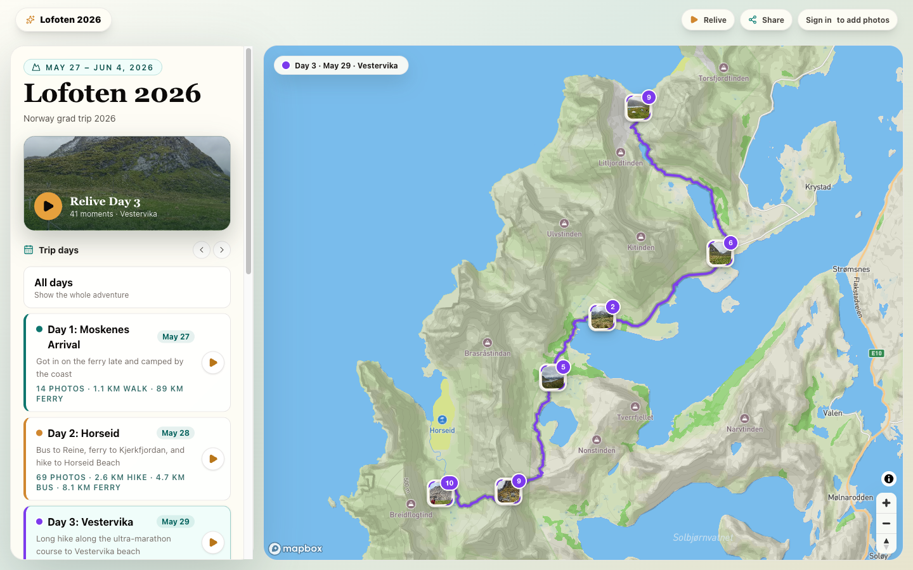
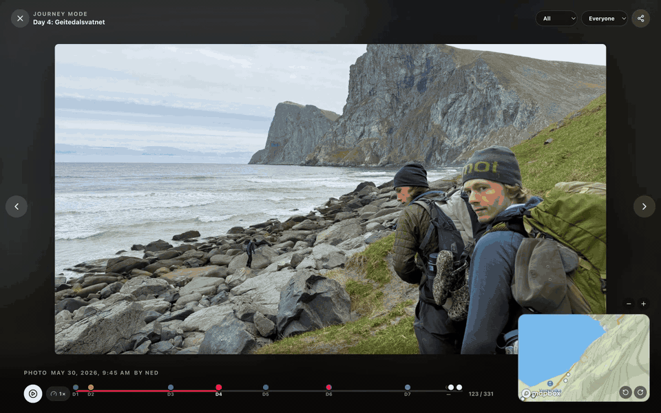
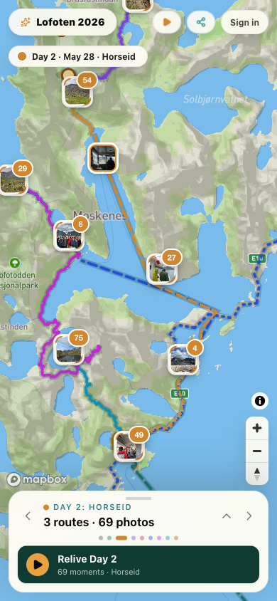

# Lofoten Logbook

A collaborative trip map and journal. Anyone can explore a trip without an
account; invited members can sign in to add geotagged photos and notes, and
admins can maintain the itinerary, routes, places, and membership.

<p>
  <a href="https://lofoten-logbook.vercel.app"><strong>▶ Live app</strong></a>
  &nbsp;·&nbsp; public reading requires no login
</p>



<p>
  
  
  
  
  
  
  
</p>

## Engineering highlights

- **Client-side EXIF geolocation.** ExifReader extracts GPS coordinates and
  capture time before upload, so a dropped photo places itself on the map.
- **Graceful placement fallback.** A photo without GPS can be placed with a map
  tap or projected along the selected day's route with Turf.js.
- **Browser-side media pipeline.** Images are resized and thumbnailed before
  upload, reducing storage and bandwidth.
- **Transactional uploads.** If a database insert fails after an R2 upload, the
  app attempts to remove the orphaned object and exposes a retryable error.
- **Database-enforced authorization.** Neon Postgres RLS implements public
  reads, member contributions, and owner-or-admin writes. Signing in alone does
  not grant edit access.
- **Duplicate and outlier checks.** Re-uploads are caught by content hash and
  by capture time and place. Admins can review photos whose position disagrees
  with shots taken around the same time and move them back to that group.
- **Route import.** Admins can import GPX tracks, which are simplified before
  they are stored as day routes.
- **Low-churn collaboration.** Visible tabs refresh Neon data every 30 seconds
  and immediately after local mutations. This replaces the previous Realtime
  subscription while keeping the UI current without a permanent connection.
- **Zero-config demo mode.** Without Neon endpoints, the app loads bundled
  sample data. A Mapbox token is still needed to render map tiles.

## Product tour

Each day gets its own color on the map, in the sidebar, and on the Journey
timeline. Selecting a day zooms to its routes and photos, and the URL updates so
any day, photo, or note can be shared as a link.

**Journey mode** (the "Relive" button) steps through the trip's photos and
videos full-screen. A minimap tracks each shot along the route, and the
timeline can jump straight to any day.



On phones the sidebar becomes a bottom sheet for switching days and starting
Journey mode. The map, popups, upload flow, and admin tools stay touch-friendly.

<p align="center">
  
</p>

## Runtime modes

- **Demo mode:** leave both Neon public endpoints unset. Bundled data powers the
  interface, and mutations stay local to the browser session. Set
  `NEXT_PUBLIC_LOCAL_DEMO_MODE=1` to force this mode on localhost even when
  `.env.local` has backend credentials; the flag is ignored on deployed hosts.
- **Shared mode:** configure Neon Auth, the Neon Data API, and Cloudflare R2.
  The browser uses Neon Auth and the RLS-protected Data API. Uploads obtain
  short-lived presigned R2 URLs from authenticated Next.js API routes; R2
  credentials never reach the browser.
- **Vercel preview:** when those shared-mode endpoints are set, preview deploys
  load the live trip through a same-origin, GET-only route and stay view-only.
  The app blocks editing, uploads, and storage writes on previews. Vercel sets
  `VERCEL_ENV` (and `NEXT_PUBLIC_VERCEL_ENV`) to `preview` automatically.

## Tech stack

- Next.js 16 (App Router), React 19, TypeScript 6, and Tailwind CSS
- Mapbox GL JS and Turf.js for maps and route geometry
- Neon Postgres, Neon Auth, and Neon Data API for data, identity, RPCs, and RLS
- Cloudflare R2 for public trip media and avatars
- ExifReader and browser canvas APIs for photo metadata and processing
- Vitest, Playwright, and GitHub Actions for unit, end-to-end, and CI checks

`@aws-sdk/*` is pinned to an exact version and `@neondatabase/neon-js` is a
pinned beta; both are bumped deliberately rather than by Dependabot, which is
configured to ignore them.

## Quick start

```bash
npm install
cp .env.example .env.local
npm run dev
```

Add `NEXT_PUBLIC_MAPBOX_TOKEN` to render the map. Leave the Neon variables blank
for demo mode.

### Environment variables

| Variable | Required | Scope | Purpose |
| --- | --- | --- | --- |
| `NEXT_PUBLIC_MAPBOX_TOKEN` | Map UI | Browser | Mapbox public access token |
| `NEXT_PUBLIC_NEON_AUTH_URL` | Shared mode | Browser | Neon Auth endpoint |
| `NEXT_PUBLIC_NEON_DATA_API_URL` | Shared mode | Browser + server | Neon Data API base URL |
| `NEXT_PUBLIC_R2_PUBLIC_URL` | Shared mode | Browser | Public media origin, without a trailing slash |
| `NEXT_PUBLIC_TRIP_SLUG` | Yes | Browser | Trip to load; defaults to `lofoten-2026` |
| `NEXT_PUBLIC_LOCAL_DEMO_MODE` | No | Browser | `1` forces demo mode on localhost only |
| `NEXT_PUBLIC_SITE_URL` | Production | Browser | Canonical deployment origin for social metadata |
| `R2_ACCOUNT_ID` | Shared mode | Server only | Cloudflare account containing the bucket |
| `R2_ACCESS_KEY_ID` | Shared mode | Server only | R2 S3 API token access key |
| `R2_SECRET_ACCESS_KEY` | Shared mode | Server only | R2 S3 API token secret |
| `R2_BUCKET_NAME` | Shared mode | Server only | Bucket containing both media namespaces |

Only `NEXT_PUBLIC_*` variables are bundled into client JavaScript. Never prefix
R2 credentials or a Neon database connection string with `NEXT_PUBLIC_`.

The R2 bucket stores two top-level namespaces while preserving the historical
bucket-relative paths:

```text
trip-photos/<existing photo path>
avatars/<existing avatar path>
```

The bucket must allow browser `PUT` requests from the deployed and local app
origins with `Content-Type`, `Cache-Control`, and `If-None-Match` headers. Public
`GET` access is supplied by `NEXT_PUBLIC_R2_PUBLIC_URL`.

## Architecture

```text
app/                  Next.js UI and authenticated R2 API routes
components/           map, journey, upload, profile, and admin interfaces
lib/backend.ts        Neon Auth + Data API browser client
lib/object-store*.ts  public R2 URLs, presigned uploads, and guarded deletion
lib/hooks/            auth, data loading, 30-second polling, and mutations
cloudflare/           media-worker: Cloudflare Worker serving public R2 objects with CORS and path validation
neon/                 target schema, patches, and export/import/verification runbook
scripts/              one-off maintenance: R2 migration, photo dedupe, orphan purge
e2e/                  Playwright specs run against demo mode
supabase/             historical source schema and rollback artifact
types/                shared trip data types
```

Neon RLS remains the source of truth for authorization. The R2 API routes pass
the caller's Neon access token to narrowly scoped database RPCs before signing
an upload or deleting an object. R2 secrets are used only on the server.

## Shared-backend setup

1. Create a Neon project, enable Neon Auth and the Neon Data API, then apply
   [`neon/schema.sql`](neon/schema.sql). Configure the app origins as trusted
   Auth/CORS origins and enable email OTP and/or Google OAuth.
   For a database created from an earlier `schema.sql`, also apply each file
   in [`neon/patches/`](neon/patches/) in date order; the `psql` command is
   shown at the top of each patch file, for example:
   `psql "$TARGET_DATABASE_URL" --no-psqlrc --set=ON_ERROR_STOP=1 --file=neon/patches/2026-09-07-can-delete-photo-object.sql`.
2. Create one R2 bucket and an S3-compatible API token scoped to that bucket.
   Configure its browser CORS policy and public media origin.
3. Add all shared-mode variables from `.env.example` locally and in Vercel.
4. Load seed data for a new installation, or follow the guarded migration
   workflow in [`neon/README.md`](neon/README.md).
   The Neon CLI project id lives in the untracked `.neon` file; recreate it
   locally with `neon set-context --project-id <id>`.
5. Sign in, ensure the initial account has an admin `trip_members` row, and
   smoke-test guest, member, owner, and admin behavior.

The browser's Neon endpoints are public configuration, not database
credentials. Data API grants plus RLS protect table and RPC access.

## Supabase migration and rollback

[`neon/README.md`](neon/README.md) is the executable migration runbook. It
covers the consistent Supabase export, verified email-based identity remap,
atomic Neon import, row-count/security checks, R2 copy ordering, cutover, and
staging cleanup.

The `supabase/` directory is intentionally retained. It records the source
schema and old migrations and is useful for auditing or rollback; it is not the
active runtime backend. The old Supabase project should remain unchanged during
the rollback window. A rollback consists of restoring the previous deployment
environment variables/build, reopening writes there, and treating Neon/R2 as
read-only until the cause is understood. Never write to both backends during a
rollback or cutover.

Before retiring Supabase, verify at least:

- all eight table counts and user mappings match the migration report;
- every referenced photo, thumbnail, and avatar resolves from R2;
- anonymous reads, OTP/Google sign-in, and sign-out work;
- member note/photo create-update-delete behavior is correctly scoped;
- admin membership, profile, itinerary, route, and request RPCs work; and
- a second visible browser receives the next 30-second refresh.

## Development

```bash
npm run dev            # local development server
npm run lint           # ESLint
npm run typecheck      # next typegen + tsc --noEmit
npm run test           # Vitest unit suite
npm run test:watch     # Vitest watch mode
npm run test:coverage  # coverage report
npm run test:e2e       # Playwright against a demo-mode production build
npm run build          # production build
npm run ci             # lint + typecheck + unit tests
```

Unit tests are colocated with the modules they cover. CI runs lint, typecheck,
unit tests, a demo-mode production build, a typecheck of the Cloudflare media
worker, and then the Playwright suite. The Playwright suite forces local demo
mode and does not contact Neon, R2, or the retired Supabase runtime.

## Roadmap

See [`docs/TODO.md`](docs/TODO.md) for active work and
[`docs/WORKLOG.md`](docs/WORKLOG.md) for completed checkpoints.
